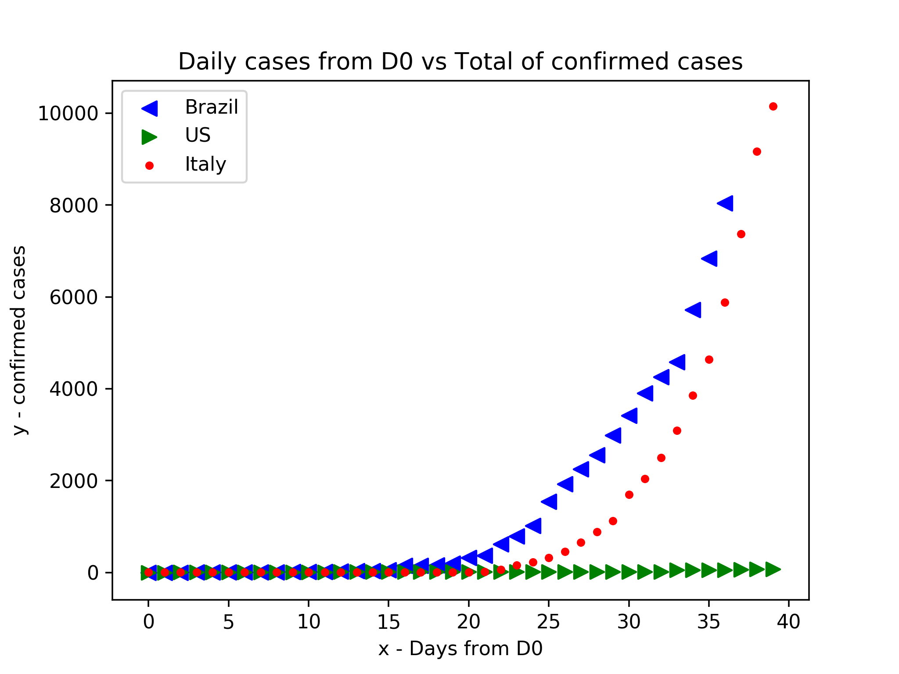

# covid-graph

This repo takes the data from https://github.com/datasets/covid-19 to generate dynamic graphs using python libraries.

# Usage

In this section we describe the usage of the program:
```
        usage: graph.py [-h] -c COUNTRIES [COUNTRIES ...] [-d DAYS] [-D DPI]
                [-o OUTPUT] [-t TYPE_COL] [-v VIEW]
```
optional arguments:
```
        -h, --help            show this help message and exit
        -c COUNTRIES [COUNTRIES ...], --countries COUNTRIES [COUNTRIES ...]
                        <Required> Set flag
        -d DAYS, --days DAYS  How many days from D0
        -D DPI, --DPI DPI     Output DPI
        -o OUTPUT, --output OUTPUT
                        Output to save PNG
        -t TYPE_COL, --type_col TYPE_COL
                        Type of case: confirmed, recovered, deaths
        -v VIEW, --view VIEW  View result: yes(y) or no(n)
```
The following is the example of the generated png inside png folder considering Brazil, US and Italy over 40 first days infected people:
```
        python3 graph.py -c Brazil US Italy -t confirmed -v yes -d 40
```

The output is the following:


The following is the example of the generated png inside png folder considering Brazil, US and Italy over 40 first days infected people considering day by day difference::
```
        python3 graph.py -c Brazil US Italy -t confirmed -v yes -d 40 --diff y
```

The output is the following:

